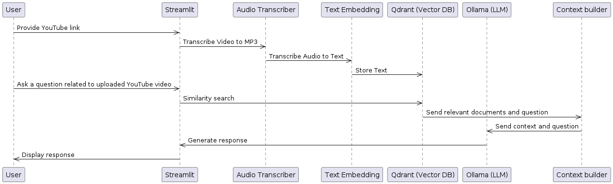

# AI-MEDIA application architecture




# Python 3.10.14 (Ubuntu)

```
curl https://pyenv.run | bash
pyenv install --list | grep 3.10.14
pyenv install 3.10.14
mkdir venv
pip install virtualenv
~/.local/bin/virtualenv --version
~/.local/bin/virtualenv  -p ~/.pyenv/versions/3.10.14/bin/python3.10 venv/
source venv/bin/activate
python3 --version   
```

# Install requirements
```
pip3 install -r requirements.txt
```

# Install ffmpeg
```
sudo apt-get install ffmpeg
```

# Run application
```
streamlit run app.py
```

# Plant UML - Ubuntu
```
sudo apt update
sudo apt install graphviz
sudo apt install plantuml
plantuml -version
```

# Troubleshooting
## ERROR: pytube.exceptions.RegexMatchError: get_throttling_function_name: could not find match for multiple
For pytube 15.0.0 in cypher.py replace 
```
r'a\.[a-zA-Z]\s*&&\s*\([a-z]\s*=\s*a\.get\("n"\)\)\s*&&\s*'
r'\([a-z]\s*=\s*([a-zA-Z0-9$]+)(\[\d+\])?\([a-z]\)',
```
to: 
```
r'a\.[a-zA-Z]\s*&&\s*\([a-z]\s*=\s*a\.get\("n"\)\)\s*&&.*?\|\|\s*([a-z]+)',
r'\([a-z]\s*=\s*([a-zA-Z0-9$]+)(\[\d+\])\([a-z]\)',
```

## ERROR: urllib.error.HTTPError: HTTP Error 400: Bad Request

SOLUTION
https://github.com/JuanBindez/pytubefix/commit/c0c07b046d8b59574552404931f6ce3c6590137d

```
pip uninstall pytube
pip install pytubefix==6.8.1
from pytubefix import YouTube
```

## ERROR: ModuleNotFoundError: No module named '_ctypes'
```
sudo apt-get -y dist-upgrade
sudo apt-get -y install build-essential python-dev python-setuptools python-pip python-smbus
sudo apt-get -y install libncursesw5-dev libgdbm-dev libc6-dev
sudo apt-get -y install zlib1g-dev libsqlite3-dev tk-dev
sudo apt-get -y install libssl-dev openssl
sudo apt-get -y install libffi-dev
pyenv uninstall 3.10.14
```

[Install again Python 3.10.14](#python-31014)
